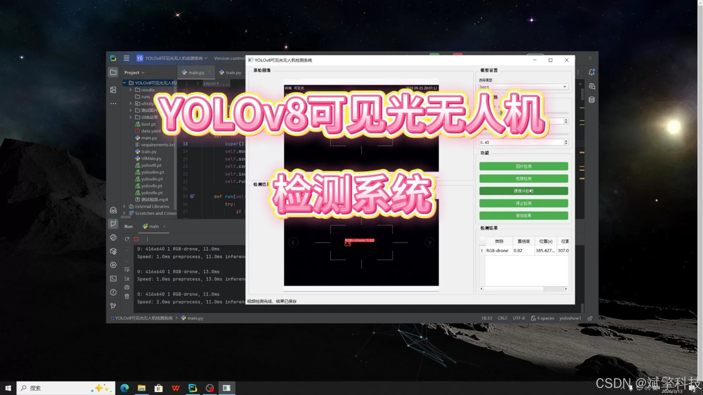
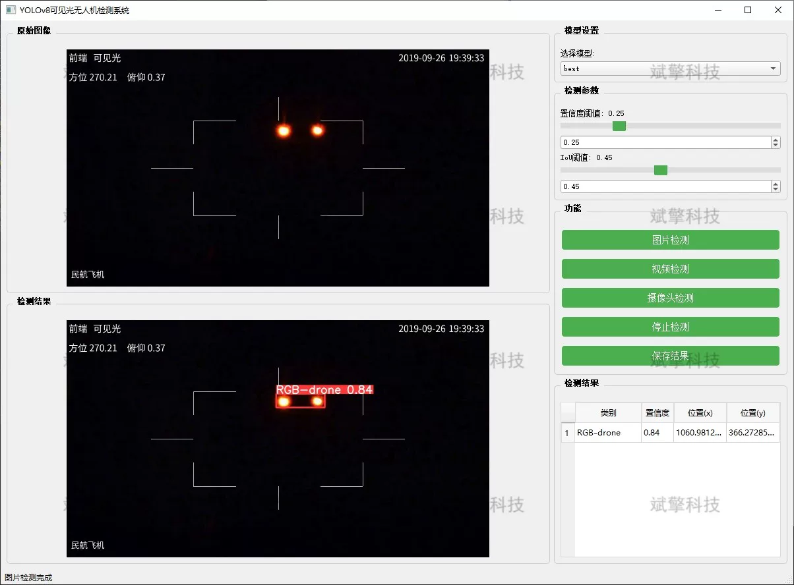
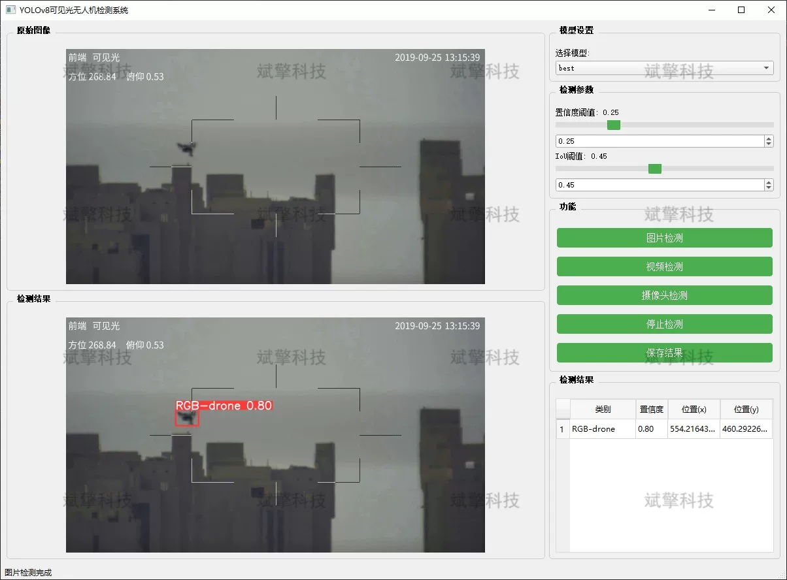
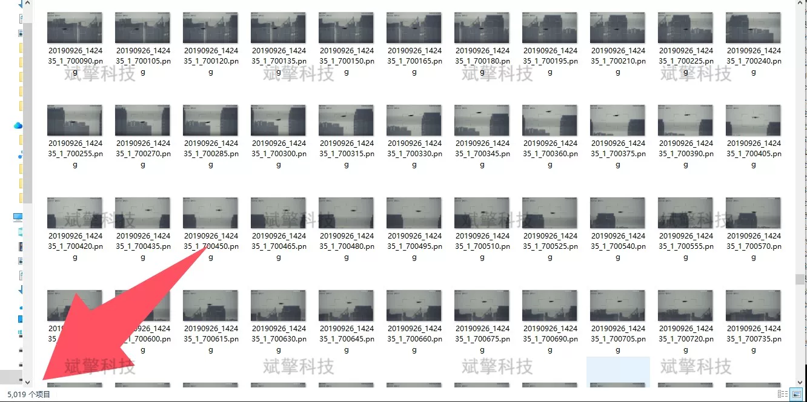
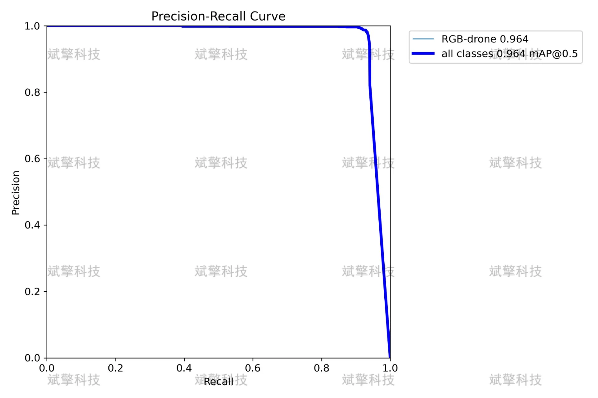

# Visible light UAV detection system based on YOLOv8 deep learning

## Body

Based on the YOLOv8 deep learning, a visible light drone detection system (YOLOv8+YOLO dataset + UI interface + Python project source code + model) has been developed.

This project constructs a dedicated drone dataset for visible light scenes and trains and optimizes the model based on the YOLOv8 network. The system not only possesses high accuracy in detection but also develops a graphical user interface that supports three core modes: image detection, video file detection, and real-time camera detection. Users can intuitively view the detection results through the software, including target confidence, position information, and real-time frame rate. This system can be widely applied in fields such as airport clear air protection, low-altitude security of important places, and sports event security, providing an efficient and intelligent technical solution for preventing drone "black flying".

System Features
✅ Image Detection: Can detect images and return detection boxes and category information.
✅ Video Detection: Supports input of video files, detecting the situation of each frame in the video.
✅ Real-time Camera Detection: Connects USB cameras to achieve real-time monitoring.
✅ Parameter adjustment in real time (confidence and IoU thresholds)
Dataset Overview
Training set: 5019 images
Validation set: 1233 images

## Images

## Payment

Here is a pay link on Stripe ( https://buy.stripe.com/3cs8yP7sY87d0vu9AB ). Please contact me lonlonago@foxmail.com after funding $89, and I will send you a complete data files , thank you!

